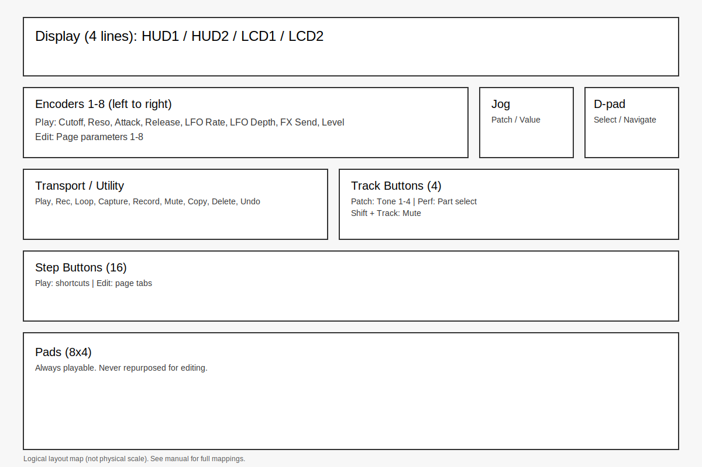
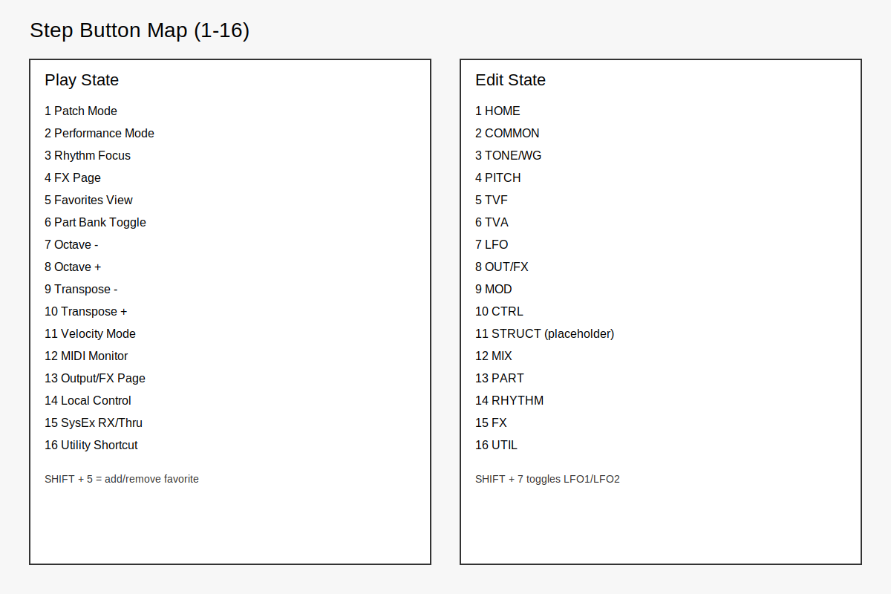

# JV-880 on Move (Module) Manual

This module turns Move into a JV-880 front panel and editor. It does not do sequencing or clip playback.

## Quick Start

1) Install ROMs on Move (required for sound):
- `/data/UserData/move-anything/modules/jv880/roms/`
- `jv880_rom1.bin`, `jv880_rom2.bin`, `jv880_waverom1.bin`, `jv880_waverom2.bin`
- Optional: `jv880_nvram.bin`

2) Launch Move Anything
- Hold **Shift + touch Volume + Knob 8**.

3) Select the **JV-880** module.

## UI States

- **Play** (default): performance control and patch/part selection.
- **Edit** (MENU): full JV parameter pages.
- **Utility** (SHIFT + MENU): system/utility access placeholder.

Navigation:
- **MENU** enters Edit (or loads a favorite if Favorites view is active).
- **SHIFT + MENU** enters Utility.
- **BACK** exits to Play.

## Display (4 Lines)

1) **HUD Line 1**: activity (encoder changes, incoming MIDI, etc.).
2) **HUD Line 2**: mode + patch name + tone/part + RX state.
3) **Line 3**:
   - Play: macro labels.
   - Edit: JV LCD line 1.
4) **Line 4**:
   - Play: macro labels.
   - Edit: JV LCD line 2.
   - Temporary help replaces line 4 for ~2 seconds after state changes.

## Encoders (8)

Play State (macros):
1 Cutoff
2 Resonance
3 Attack
4 Release
5 LFO Rate
6 LFO Depth
7 FX Send
8 Level

Edit/Utility State:
- Encoders map to the current page parameters (8 per page).
- Touch shows parameter info without changing value.
- SHIFT + turn = fine adjust.

## Pads

- Always play the engine (not repurposed for editing).
- Velocity affects level; aftertouch follows JV modulation routing.

## Jog + D-pad

Play State:
- **Left/Right/Jog**: patch change.
- **SHIFT + Left/Right**: bank change.

Edit/Utility State:
- **Left/Right/Up/Down**: parameter selection.
- **Jog**: value change.

## Track Buttons (4)

Patch Mode:
- Track 1–4 selects Tone 1–4.
- SHIFT + Track toggles tone mute.

Performance Mode:
- Track 1–4 selects Part within bank.
- SHIFT + Track toggles part mute.
- Part banks toggle with Step 6 (Parts 1–4 vs 5–8).

## Step Buttons (16)

Play State shortcuts:
1 Patch Mode
2 Performance Mode
3 Rhythm Focus
4 FX page
5 Favorites view (toggle)
6 Part Bank toggle
7 Octave −
8 Octave +
9 Transpose −
10 Transpose +
11 Velocity Mode (HUD only)
12 MIDI Monitor toggle (HUD only)
13 Output/FX page
14 Local Control toggle (HUD only)
15 SysEx RX/Thru toggle (HUD only)
16 Utility shortcut

Edit State tabs:
1 HOME
2 COMMON
3 TONE/WG
4 PITCH
5 TVF
6 TVA
7 LFO (SHIFT + this tab toggles LFO1/2)
8 OUT/FX
9 MOD
10 CTRL
11 STRUCT (placeholder; JV-880 has no true structures)
12 MIX
13 PART
14 RHYTHM
15 FX
16 UTIL

## Transport / Utility Buttons

- PLAY: audition latch (HUD only for now).
- REC (seq): MIDI monitor toggle (HUD only).
- LOOP: sustain latch (on/off).
- CAPTURE: compare (HUD only).
- REC (audio): Panic / All Notes Off.
- SHIFT + REC (audio): Reset controllers.
- MUTE: mute selected tone/part.
- COPY: copy (HUD only).
- DELETE: init/clear confirm (MENU = confirm, BACK = cancel).
- UNDO: undo (HUD only); SHIFT + UNDO: redo (HUD only).

## Favorites

- Step 5 toggles Favorites view.
- SHIFT + Step 5 adds/removes current patch to favorites.
- In Favorites view:
  - Jog or Left/Right selects.
  - MENU loads selection.
  - BACK exits.

Favorites save to `favorites.json` in the module folder.

## Troubleshooting

No sound:
- Confirm ROMs exist at `/data/UserData/move-anything/modules/jv880/roms/`.
- Ensure Move Anything is running and JV-880 is selected.
- Try a different patch; some may be quiet or filtered.

Cutoff changes are subtle:
- Increase Resonance (encoder 2) and sweep Cutoff (encoder 1).
- Use a brighter patch or increase Level (encoder 8).

Step buttons make sound:
- They should not. If you hear notes, update to the latest module build.

## Layout Images

